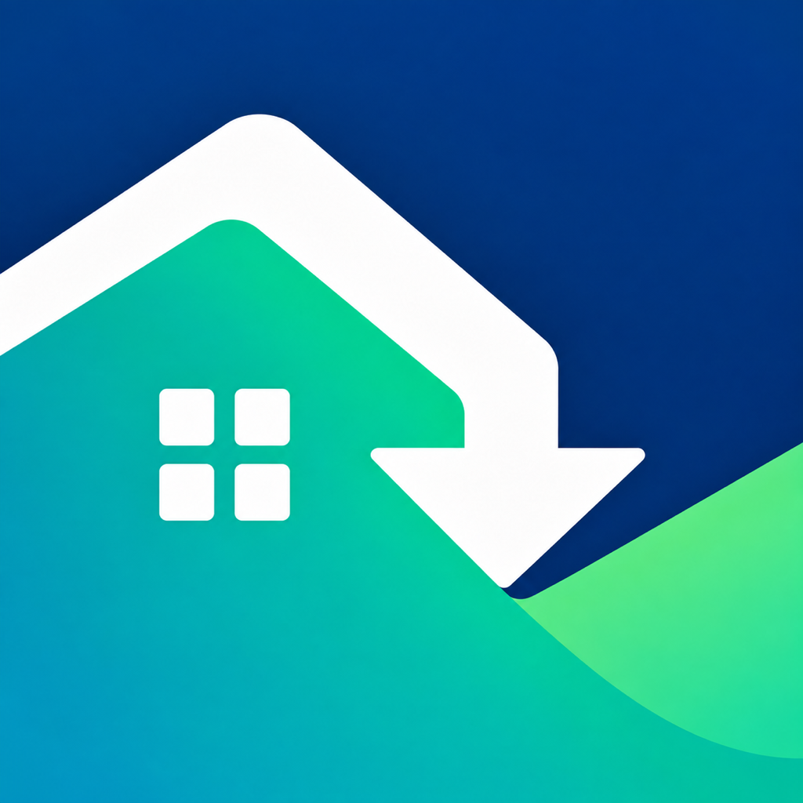

<div align="center">
  

  # Offset

  **Understand the real price of clean-energy upgrades.**

  Offset helps homeowners and renters discover verified incentives, estimate project costs, and keep every claim step organized.
</div>

## See Offset in action

<div align="center">
  <a href="https://www.youtube.com/watch?v=bMc3Vl0aYr8">
    
  </a>
  <br />
  <sub><a href="https://www.youtube.com/watch?v=bMc3Vl0aYr8">Watch the product demo on YouTube</a></sub>
</div>

## What it does

- Finds incentives for heat pumps, insulation, solar, EVs, chargers, and efficient water heaters.
- Applies eligible programs in a clear order to estimate the real project price.
- Keeps official sources, deadlines, saved projects, and claim checklists together.

Offset launches with verified New York coverage. California and Florida coverage is currently partial and clearly labeled in the app.

## Run locally

Requires Xcode and an iOS 16+ simulator or device.

```bash
git clone https://github.com/sujaldeshmukh1012/Offset.git
cd Offset
cp Offset/Configuration/Secrets.example.xcconfig Offset/Configuration/Secrets.xcconfig
open Offset.xcodeproj
```

Configure the service values in `Secrets.xcconfig`, then build the `Offset` scheme.

---

<div align="center">
  Built with SwiftUI for iPhone and iPad.
</div>
